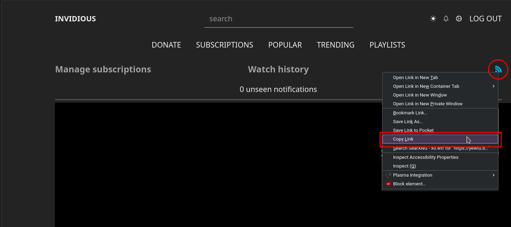

# YouTube Subcriptions Feed

Provides a minimalist interface to access the latest videos from your YouTube (Invidious) subscriptions.

## Requirements:

- [yt](nikhilmwarrier.github.io/yt) and its dependencies.
- Node.js (and npm)
- A URL to your atom/xml subscription feed from Invidious. [(Get one)](#how-to-get-a-subscription-feed)

## Run

```bash
$ git clone 'https://github.com/nikhilmwarrier/yt-feed'
$ cd 'yt-feed'
$ node index.js
```

## How to get a subscription feed?

1. Log in to (or sign up for) an account on [an Invidious instance](https://invidio.us/).
2. Navigate to https://<your-instance-url>/feed/subscriptions
3. Copy the URL to your atom/xml feed.
   
